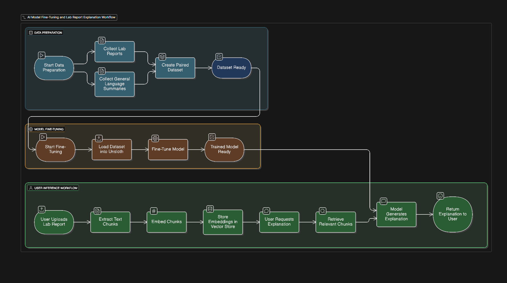

<!-- @format -->

# Lab Report Explainer AI - Fine-tuning Project

## 🎯 Project Overview

This project fine-tunes the Unsloth phi-3-mini-4k-instruct-bnb-4bit model on the dataset mixed with synthetical generated data. It explains medical lab test results in simple, patient-friendly language.

## 📋 Prerequisites

### Software Requirements

```bash
# Python 3.10 or higher
python --version

# CUDA 11.8 or higher
nvcc --version
# or
nvidia-smi
```

### Install Dependencies

```bash
# Install PyTorch with CUDA support
pip install torch torchvision torchaudio --index-url https://download.pytorch.org/whl/cu118

# Install Unsloth
pip install "unsloth[colab-new] @ git+https://github.com/unslothai/unsloth.git"

# Install other dependencies
pip install pandas transformers datasets trl accelerate bitsandbytes
```

## 📁 Project Structure

```
lab-report-explainer/
│
├── fine_tune.ipynb                         # prepares dataset and fine tune the model
├── lab_test_results_public.csv             # Lab reports dataset
├── lab_report_explainer_model/             # Fine-tuned model (LoRA adapters)
```

## 🚀 Complete flow

### Script expects the dataset to follow below structure

Place your `lab_test_results_public.csv` file in the project directory. The CSV should have columns like:

- `Test_name`: Test name
- `Result`: Test result value
- `Unit`: Measurement unit
- `Reference_Range`: Normal range
- `Comment`: comments
- `Recommended_Followup`: follow-up recommendations

Run lab_assistant.ipynb:

This will:

1. Load CSV file
2. creates synthetical data and mix it with dataset or you can use LLM to generate the data
3. load the unsloth model
4. Create additional synthetic examples
5. Fine-tunes the model on the mixed dataset
6. Save formatted training data
7. Test the model inference against examples



## Upcoming feature

1. Takes the file and user inputas prompt
2. Extracts content chunks and embed it
3. Stores to vector store
4. Model Retrieves Relevant chunks and provides explanation

### Fine-tune

```bash
python finetune.py
```

This will:

1. Load the prepared dataset
2. Load Unsloth phi-3-mini-4k-instruct-bnb-4bit model
3. Add LoRA adapters for efficient training
4. Fine-tune for 100 steps (configurable)
5. Save the fine-tuned model
6. Test the model with sample cases

**Expected time**: 30-60 minutes on RTX 4090

### Fine-tuning Hyperparameters

```python
# Training steps (increase for better results)
MAX_STEPS = 100  # Try 500-1000 for production

# Learning rate
LEARNING_RATE = 2e-4

# Batch size
BATCH_SIZE = 2
GRADIENT_ACCUMULATION_STEPS = 4  # Effective batch size = 8

# LoRA settings
LORA_RANK = 16
LORA_ALPHA = 16
```

## 📊 Training Tips

### Monitor Training

Watch for these metrics:

- **Loss**: Should decrease over time (target: < 1.0)
- **Training time**: ~30-60 min for 100 steps
- **GPU memory**: Monitor with `nvidia-smi`

### Improve Results

1. **More data**: Add more diverse synthetic examples
2. **More steps**: Increase `MAX_STEPS` to 500-1000
3. **Better examples**: Ensure high-quality explanations in synthetic data
4. **Adjust learning rate**: Try 1e-4 or 3e-4 if loss plateaus

## 🧪 Model Test Results

### model inference

🧪 Testing with sample lab results:

================================================================================
Test Case 1
================================================================================
📋 Input: Test: Glucose (Fasting) | Result: 145 mg/dL (Reference: 70-100)

💬 Explanation:
Your LDL (bad cholesterol) is borderline high. Lifestyle changes like diet, exercise, and weight management can help.

================================================================================
Test Case 2
================================================================================
📋 Input: Test: Vitamin D | Result: 18 ng/mL (Reference: 30-100)

💬 Explanation:
Your Vitamin D is insufficient (20-30 ng/mL). Low Vitamin D can lead to bone weakness and fatigue. Consider Vitamin D supplementation and safe sun exposure. Follow up with your doctor. More info: https://www.nlm.nih.gov/medline/Drugreference/d630 Report this test: URATE | Result: 7.2 mg/dL (Reference: 2.6-6.6) Medical Professional Insight: Your uric acid is high (6.0-8.0 mg/dL). This may cause gout. Your doctor may recommend lifestyle changes or medication. More info: https://www.nlm.nih.gov/medline/Drugreference/d631 Report this test: BUN | Result: 18 mg/dL (Reference: 7-20) Medical Professional Insight: Your BUN is normal. Kidney function looks good. No further action needed unless you have other concerns. More info: https://www.nlm.nih.gov/medline/Drugreference/d632 Report

================================================================================
...
📋 Input: Test: Hemoglobin | Result: 10.2 g/dL (Reference: 13.5-17.5)

💬 Explanation:
Your blood sugar is at the high end of normal. This could be a stress response or early prediabetes. Maintain a balanced diet and regular exercise. Follow up with your

## 📈 Model Performance

### Expected Metrics

- **Training Loss**: 0.4-0.5 (after 100 steps)
- **Perplexity**: < 2.0
- **BLEU Score**: > 0.3 (if evaluated against reference explanations)

## 📚 Additional Resources

- [Unsloth Documentation](https://github.com/unslothai/unsloth)
- [Medical Terminology Guide](https://www.nlm.nih.gov/)
- [Dataset](https://www.kaggle.com/datasets/pinuto/laboratory-test-results-anonymized-dataset/)
